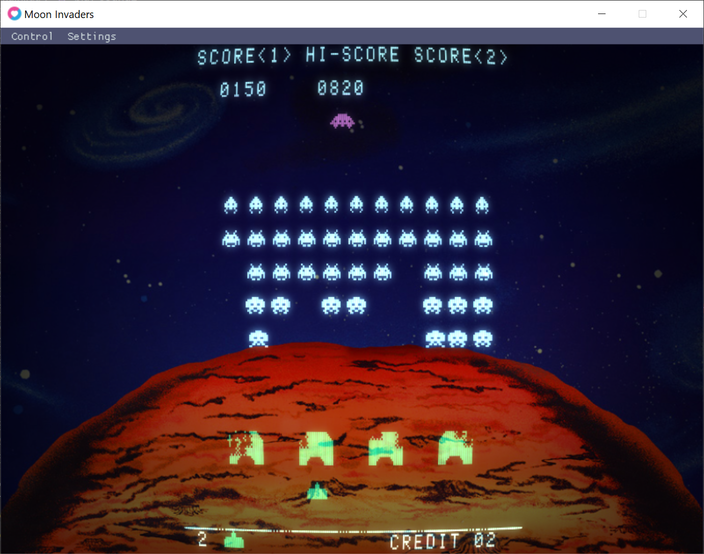

Moon Invaders
=============

A _Space Invaders_ emulator made with [LÖVE](https://love2d.org).



Features
--------

* Persistent high scores that are saved between runs!
* Authentic-looking CRT shaders
* Customizable colored gel overlay
* Backdrop support
* Sound support (for user-provided sound files)

Controls
--------

| Key        | Action              |
|------------|---------------------|
| Arrow keys | Move (both players) |
| Space      | Fire (both players) |
| C          | Insert coin         |
| 1          | Start 1 player mode |
| 2          | Start 2 player mode |
| T          | Tilt                |

How to run
----------

If you're on Windows or macOS, the easiest is to download the latest release from the [Releases](https://github.com/tobiasvl/moon-invaders/releases) page.

If you're on Linux:

First install [LÖVE 11.3](https://love2d.org). Your Linux distribution might have it in its package repository, but there are no guarantees that this emulator works with older versions of LÖVE.

For Ubuntu, there's a third-party repository you can use to install LÖVE 11.3:

```
sudo add-apt-repository ppa:bartbes/love-stable
sudo apt install love
```

Then clone or download this repository, including submodules with `--recursive`, and run LÖVE:

```
git clone --recursive https://github.com/tobiasvl/moon-invaders.git
love moon-invaders/
```

Note that to get the menu bar at the top of the window you will need to install [love-imgui](https://github.com/slages/love-imgui), but you will need to build it yourself since the [Lua rock](https://luarocks.org/modules/slages/love-imgui) requires an older version of LÖVE.

Setup
-----

You will then need to supply the emulator with ROM files, and some additional optional assets, in order to play.

For all the following files, put them in the following locations:

* Windows, one of the following:
  * The `assets` directory inside the game's folder (containing the `.exe` file)
  * `C:\Users\<your username>\AppData\Roaming\Moon Invaders\assets\`
* Linux, one of the following:
  * `$XDG_DATA_HOME/love/Moon\ Invaders/assets/`
  * `~/.local/share/love/Moon\ Invaders/assets/`
* macOS: `/Users/<your username>/Library/Application Support/LOVE/Moon Invaders/assets/`

<h3>ROM</h3>

You will need to supply your own Space Invaders ROM files. There are four files:

* `invaders.e`
* `invaders.f`
* `invaders.g`
* `invaders.h`

<h3>Images</h3>

These are optional:

* `background.png`: Background image
* `overlay.png`: Colored gel overlay, see the default one for the format

<h3>Sounds</h3>

The sound files found online have different file names, so two variations per file are supported. These are optional.

* `0.wav` / `ufo_highpitch.wav` (UFO flying)
* `1.wav` / `shoot.wav` (player firing)
* `2.wav` / `explosion.wav` (player death)
* `3.wav` / `invaderkilled.wav` (alien death)
* `4.wav` / `fastinvader1.wav` (alien fleet movement "heartbeat")
* `5.wav` / `fastinvader2.wav`
* `6.wav` / `fastinvader3.wav`
* `7.wav` / `fastinvader4.wav`
* `8.wav` / `ufo_lowpitch.wav` (UFO death)
* `9.wav` / `extendedplay.wav` (extra life)

Note that at least one website that provides these files for download have swapped the names of `shoot.wav` and `invaderkilled.wav`.
